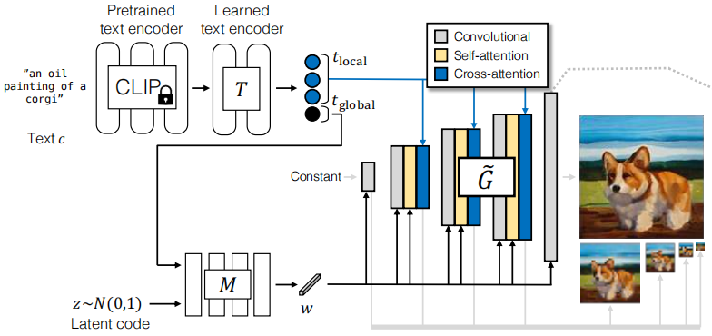
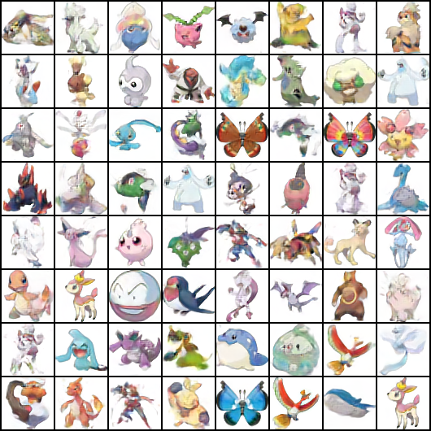

# GigaGAN
Implementation of [GigaGAN: Scaling up GANs for Text-to-Image Synthesis](https://arxiv.org/pdf/2303.05511).

```shell
pip install transformers==4.27.4 datasets
```

| iteration | sample | batch | adaptive kernel | g_use_self_attn | d_use_self_attn | multi-scale loss |
| :-------: | :----: | :---: | :-------------: | :-------------: | :-------------: | :--------------: |
| 330000 |  | 16 | √ | √ | × | × |

# References
- https://github.com/rosinality/stylegan2-pytorch
